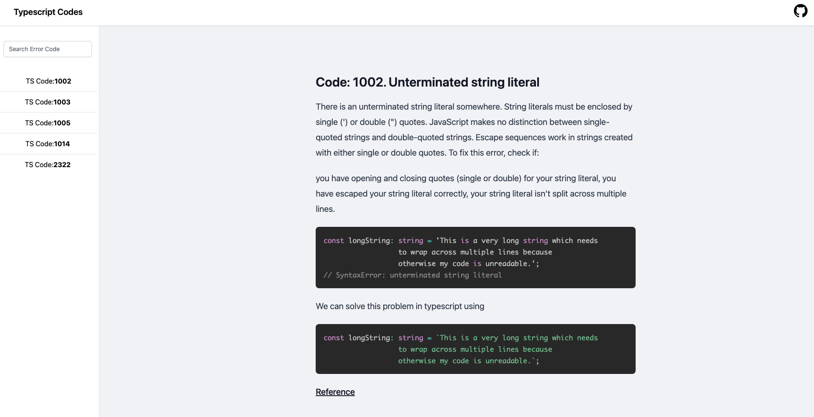

<div align="center">
  <br>
  
  <h1>Typescript Error Codes</h1>
  <strong>Stackoverflow for Typescript Errors.</strong>
</div>
<br>
Solution for Typescript errors are scattered across the internet. This repository provides a structured and organized way to find the typescript errors and solutions for it.

[
](https://ts-error-codes.vercel.app/)

### Development

Clone this repository, install the dependancies and start the application

```
 git clone https://github.com/ganeshmani/ts-error-codes
 npm install
 npm run dev
```

### Contribution

Looking for places to contribute to the codebase?
read the [contribution guidelines](https://github.com/ganeshmani/ts-error-codes/blob/main/contribution.md).
